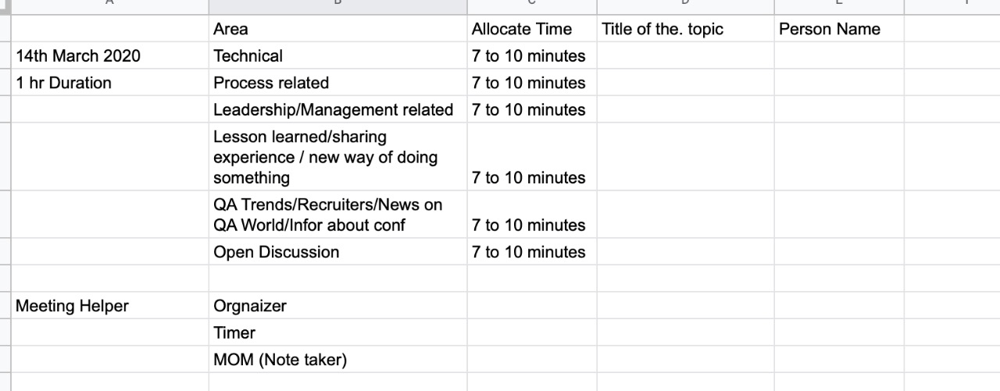

# QALeaders

#### Note: Dates are in the format MM/DD/YYYY

Click to expand for MoM happened on 02/07/2020

<h3>Abhijit Gupta</h3>

- Online & Offline
- Technical, Process related like Kanban, lessons learned as QA Manager
- What kind of individuals are the QA Managers looking at?
- Invite QA Leader, Recruiters etc., for talks
- Role: Who will drive this meeting? Like organiser, who will promote it? Can we create LinkedIn Page, Twitter Page etc., and promote it so that larger audience will take advantage of it.
- Strict timelines need to be followed for sessions.
- Commitment from individuals.
- Share the ideas what we can do to
  - Initially we can start with online meeting , later we can start local chapters.
  - Online meeting can be weekly or biweekly
  - Duration can be 1 hr.
  - Can be structured
    - A) Technical
    - B) Process related
    - C) Leadership/Management related
    - D) Lesson learned/sharing experience / new way of doing something
    - E) Open Discussion
    - F) Invite recruiters/
- How to ensure all participates / contribute / share knowledge .
- Each member can commit 10 to 15 minutes of Knowledge sharing per quarter/ Point based /member can earn points
- What kind of commitment we need from members ?
  - Each member can commit 10 to 15 minutes of Knowledge sharing per quarter/ Point based /member can earn points
- Do we need to create dedicated roles ?
  - Monthly/Quarterly/Annual
- <b><u>VP Marketing:</u></b> Group promotion among other members QA Leaders/Architect/QA Managers/QA Director/Plans and directs programs to retain and increase club membership.
- Meeting Organisation/follow up with members/Plans and publishes regular schedules of meeting assignments.
- <b><u>VP/Education:</u></b>Arrange some short training program by interacting with different people. We may see interesting people in linkedin who are sharing knowledge, we can invite then to give talk, maybe invite some recruiters to see hiring trends.
- Create a. QA Leaders linked page / promote
- Technical meeting is short 5-7 minutes because which answers what is problem statement, what are the building blocks, Detailed training session can be breakout sessions.
- We can maintain a google sheet like this for weekly sessions , but instead of 14th , we can start after few weeks, once we formalise everything, roles and responsibilities, how to motivate members, how to promote to qa leaders . We have slack channel, LinkedIn page, once we have at least 40+ active members, this will be successful.
  

### <h3>Abdul</h3>

- e-learning process on latest technologies.

### <h3>Brijesh Deb</h3>

- Online meetups
- At least 10 mins per quarter, on anything, any technical, leadership, management or even Psychology
- Start Podcast series. There is no podcasts from India. Explore open source options for podcasts.
- Broadcasts as well, maybe a quick video byte and put on YouTube, Instagram, Twitter etc.,
- What’s in it for me? This should be answered.
- June Conference in Bangalore: Devops++ alliance.

### <h3>Khaja</h3>

- We need ladies and girls on this forum.
- Github?
- Let’s make QALeaders as FreeCodeCamp of testing
- Quarterly Online Conferences: like AllDayDevops, OnlineTestingConferences etc.,
- Monthly online meet-ups that should cover one tech and non-tech
- Latest Tech: AI, Blockchain etc.,
- Can we start using Slack, moving away from Whatsapp.

### <h3>Naveen Kumar Bysaini</h3>

- Create Google Docs with people and their skillset, what areas they can share their knowledge.

### <h3>Prakash Thomas</h3>

- Share more job related information.
- QAMasterMind Generic session.

### <h3>Sai M</h3>

- Will provide trainings on Java, Javascript and pretty much anything.

### <h3>Siva Kumar Avadhanam</h3>

- Come up with innovative ideas like create unique apps, solutions, etc., Welcome innovative apps from the team.

### <h3>Sumit Lakhotia</h3>

- Thanks for joining from West :)

### <h3>Tulika Tamane</h3>

- Looking for opportunity. E2E Program Test management and Selenium.
- Expecting new tools and tech from this group
- Start sharing excellent online courses from groups like Udemy etc.,

### <h3>Mani</h3>

- Moved to SRE from Automation developer role.
- Can we have Slack channel?
  

